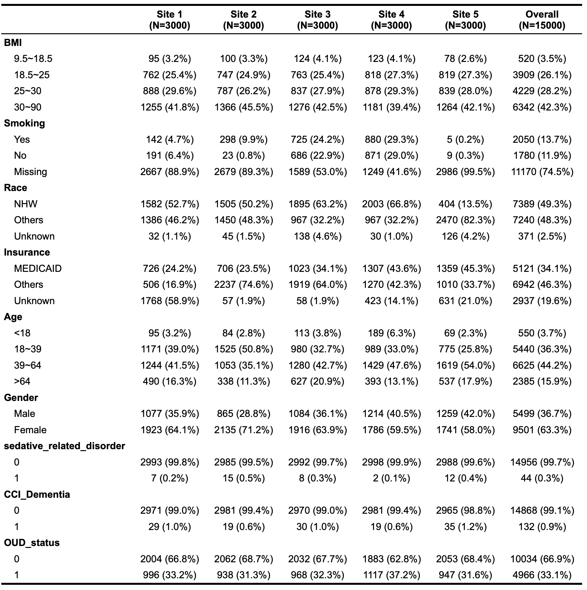
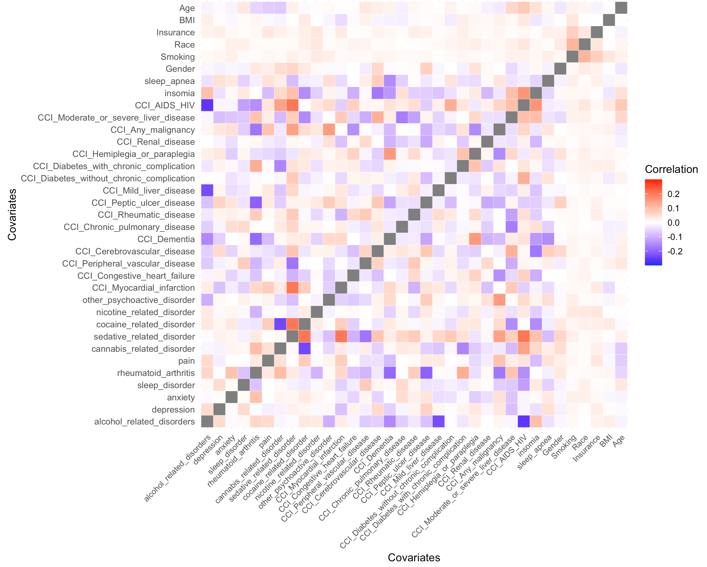
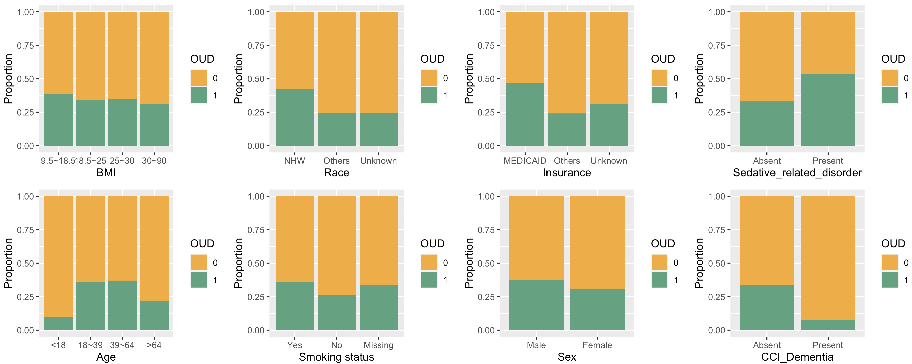
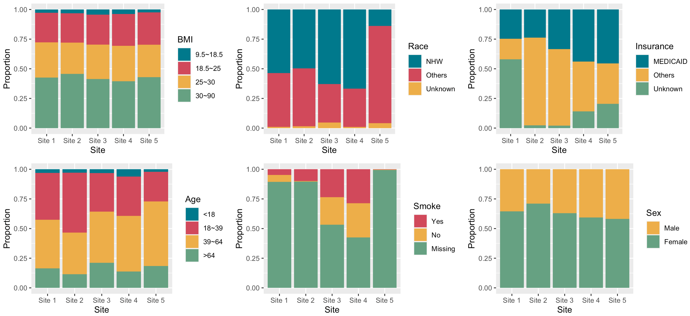
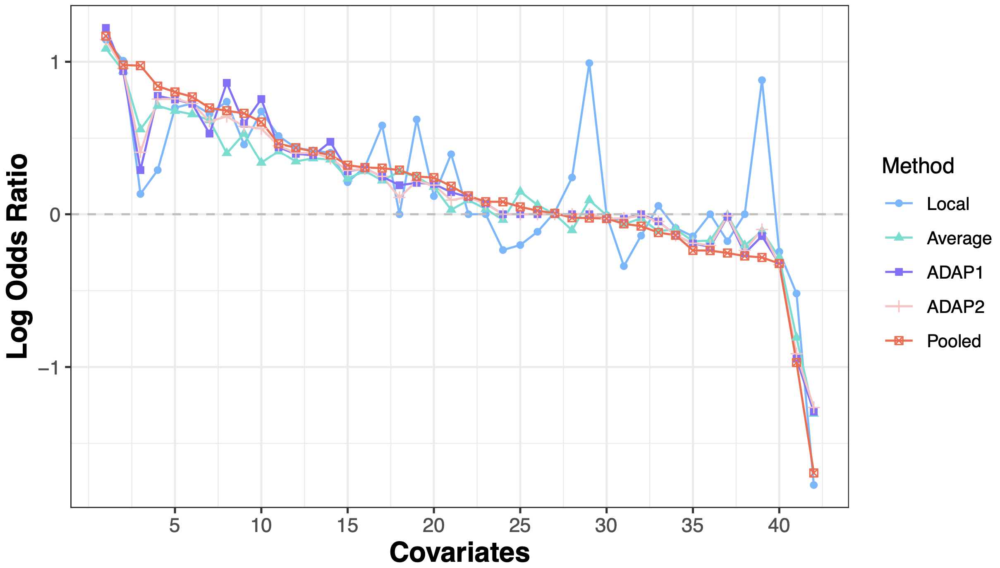
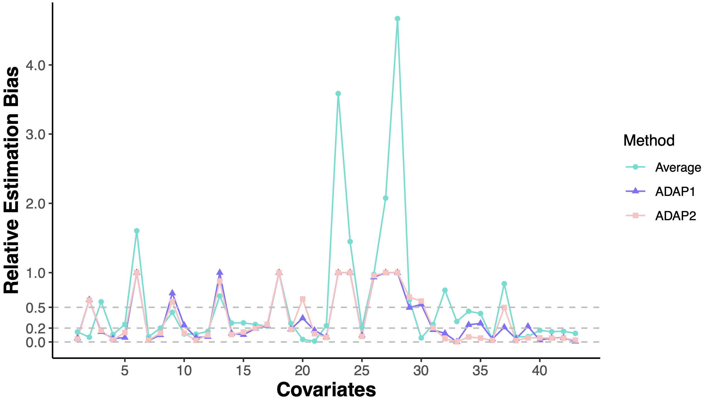

# ADAP
A Distributed Algorithm for fitting Penalized (ADAP) regression models 

## Outline

1. Description 
2. Opioid use disorder (OUD) analysis

## Description

Integrating data across institutions can improve learning efficiency. ADAP is proposed for integrating data efficiently while protecting privacy for fitting penalized regression models across multiple sites. ADAP utilizes patient-level data from a lead site and incorporates the first-order (ADAP1) and second-order gradients (ADAP2) of the objective function from collaborating sites to construct a surrogate objective function at the lead site, where model fitting is then completed with proper regularizations applied. 

The implementation of ADAP in a practical collaborative learning environment is assembled into the R package [PDA: Prevacy-preserving Distributed Algorithms](https://github.com/Penncil/pda) where multiple distributed learning algorithms are available to fulfill various analysis demands. Toy examples to illustrate the fitting process of ADAP are also available in [PDA](https://github.com/Penncil/pda). 

ADAP is used in a real-world application to study risk factors for opioid use disorder (OUD) using 15,000 patient data from the OneFlorida Clinical Research Consortium. Since the OneFlorida+ data is available only upon application, for the reader’s convenience, an illustrative synthetic dataset is genereted to simulate the true OneFlorida+ data. Specifically, the covariates are drawn from the empirical distribution of the true covariates, and the estimated coefficients from the OUD analysis are used to generate the OUD status by using a sparse logistic regression model. This page is prepared for conducting the OUD analysis with this synthetic dataset where the generated patient-level records from all sites are available. We directly apply the R functions of implementing ADAP without installing the PDA package for convenience.    


## OUD analysis

The OneFlorida data repository integrates multiple data sources from its participating healthcare organizations and provides real-world data to support biomedical and clinical research. Here, data are generated to mimic EHRs extracted from 5 participating sites with 15,000 patients who had chronic pain and an opioid prescription (including buprenorphine, codeine, fentanyl, hydromorphone, meperidine, methadone, morphine, oxycodone, tramadol, and hydrocodone) and no cancer or OUD diagnosis before their first opioid prescription. Among these patients who were exposed to an opioid, we define a case of OUD as having a first diagnosis of OUD after their first prescription and define a control as having no diagnosis of OUD during the entire time window. A list of risk factors (in total 42 covariates) was compiled from the literature and extracted from the database, including basic demographic features such as age, gender and race, and co-occurring diagnoses, e.g., depression and sleep disorder. A logistic lasso regression is then applied to locate truly influential risk factors. 

Before we step into the fitting process of ADAP, some exploratory analyses on the data are helpful to get a general understanding of the problem. Table1 below summarizes 5,000 patient records over several selected covariates: 

From the table we can see that across 5 sites, most of the patients don't have records for smoking, and this missingness could be not at random. Instead of conducting an imputation or deleting these patients from the analysis, we treat the petients with missing smoking status as a separate group to check its relationship with the outcome. The same goes with race and insurance. Moreover, there are some covariates that have low prevalence across sites, e.g., the sedative related disorder which has only 2 records on Site 4. If a single-site study is conducted at Site 4, the fitting procedure could be problematic due to the extremely low prevalence of the covariate, and this necessities a joint modeling procedure to leverage informtion across all sites. 

When applying a generalized linear regression, a detection of the potential high-collinearity among the covariates is helpful to avoid some fitting issues. The following heatmap of the correlation among all covariates provides the required information. Note that since the covariates we used in this analysis are all binary or categorical, the correlation between binary outcomes is calculated by the tetrachoric correlation which takes value from -1 to 1, the correlation between nominal variables is measured by the Cramer's V statistics which takes value from 0 to 1, and the correlation between ordinal variables is measured by the polychoric correlation which takes value from -1 to 1. 

The heatmap tells us that there is only low correlation between covariates, and therefore, no further maniputation of the data is needed. 

To detect the potential effects of each covariate on the outcome, some graphical tools can be used here. Since the outcome is a binary variable, when the covariate is continuous the loess technique is a good choice to get an inspection of the relationship between the covariate and the outcome. For the binary/categorical covariates we considered here, a percentage barplot is helpful to visualize at which category of a variable the case has a higher prevalence. Below we show the plots for some covariates:

Take age as an example, the percentage barplot of OUD status by the categories of age shows that the prevalence of OUD is higher for patients whose age are 18-39 and 39-64 than that of the elder patients (> 64), while the prevalence of OUD is low for young patients whose age is less than 18 compared with the elder patients (> 64). Therefore, if we treat the elder group as a reference group and define the dummy variables in the following way: age_1 equals to 1 if age <18 and equals to 0 otherwise, age_2 equals to 1 if age is between 18 and 39 and equals to 0 otherwise, age_3 equals to 1 if age is between 39 and 64 and equals to 0 otherwise. Then, it is expected that the regression coefficient of age_1 is negative and the regression coefficients for age_2 and age_3 are positive. A similar inspection can be conducted for all covariates that are of our interest. 

Another concern in distributed learning tasks is the heterogeneity across sites, which may impedes the application of some methods that have a homogeneity assumption. Here we also visualize the distribution of some covariates to detect the existence of heterogeneity in covariate distributions across sites. 

From the above plot, we can see that the age composition shows some sort of heterogeneity across sites, and this calls for a method that is robust to the violation of homogeneity assumption in covariate distribution, which is exactly what ADAP2 can handle. Next, let's apply the proposed methods to the OUD dataset.  


```{r}
load("OUD_synthetic.rda")
site <- as.numeric(OUD_synthetic$Site)
Yall <- as.numeric(OUD_synthetic$OUD_status)
Xall <- as.matrix(OUD_synthetic[, -c(1,2)])

set.seed(100)
library(glmnet)
source("functions.r")
fit.res <- compare.methods(Xall, Yall, site, local_site = c(1,2), norder = NULL) 
res_mat <- cbind(fit.res$estimation_local, fit.res$estimation_ave, 
                 fit.res$estimation_odal1_5cv, fit.res$estimation_odal2_5cv,
                 fit.res$estimation_pooled)
colnames(res_mat) <- c("Local", "Average", "ADAP1", "ADAP2", "Pooled")
# display fitting results
knitr::kable(round(res_mat, 2), booktabs = TRUE, caption = 'Fitting Results')
# Table: Fitting Results
# 
#   |                                          | Local| Average| ADAP1| ADAP2| Pooled|
#   |:-----------------------------------------|-----:|-------:|-----:|-----:|------:|
#   |(Intercept)                               | -3.12|   -2.53| -3.12| -2.84|  -2.96|
#   |alcohol_related_disorders                 |  0.05|   -0.11| -0.05| -0.05|  -0.12|
#   |depression                                |  0.00|    0.03|  0.07|  0.07|   0.08|
#   |anxiety                                   |  0.51|    0.41|  0.44|  0.45|   0.46|
#   |sleep_disorder                            |  0.00|   -0.20| -0.26| -0.24|  -0.27|
#   |rheumatoid_arthritis                      | -0.11|    0.06|  0.00|  0.00|   0.02|
#   |pain                                      |  0.31|    0.28|  0.30|  0.30|   0.31|
#   |cannabis_related_disorder                 |  0.46|    0.53|  0.60|  0.58|   0.66|
#   |sedative_related_disorder                 |  0.13|    0.56|  0.29|  0.41|   0.97|
#   |cocaine_related_disorder                  |  0.66|    0.62|  0.53|  0.61|   0.70|
#   |nicotine_related_disorder                 |  0.42|    0.37|  0.39|  0.40|   0.41|
#   |other_psychoactive_disorder               |  0.29|    0.71|  0.78|  0.76|   0.84|
#   |CCI_Myocardial_infarction                 | -0.14|   -0.03|  0.00| -0.01|  -0.08|
#   |CCI_Congestive_heart_failure              |  0.21|    0.23|  0.28|  0.29|   0.32|
#   |CCI_Peripheral_vascular_disease           |  0.00|   -0.17| -0.21| -0.20|  -0.24|
#   |CCI_Cerebrovascular_disease               | -0.14|   -0.18| -0.19| -0.19|  -0.24|
#   |CCI_Dementia                              | -1.77|   -1.31| -1.29| -1.26|  -1.69|
#   |CCI_Chronic_pulmonary_disease             |  0.01|    0.00|  0.00|  0.00|   0.01|
#   |CCI_Rheumatic_disease                     |  0.58|    0.22|  0.25|  0.25|   0.30|
#   |CCI_Peptic_ulcer_disease                  |  0.00|    0.28|  0.19|  0.11|   0.29|
#   |CCI_Mild_liver_disease                    |  0.62|    0.24|  0.21|  0.22|   0.25|
#   |CCI_Diabetes_without_chronic_complication |  0.00|    0.09|  0.11|  0.11|   0.12|
#   |CCI_Diabetes_with_chronic_complication    |  0.24|   -0.10|  0.00|  0.00|  -0.02|
#   |CCI_Hemiplegia_or_paraplegia              | -0.23|   -0.04|  0.00|  0.00|   0.08|
#   |CCI_Renal_disease                         |  0.44|    0.35|  0.40|  0.40|   0.44|
#   |CCI_Any_malignancy                        | -0.18|   -0.01| -0.02| -0.01|  -0.25|
#   |CCI_Moderate_or_severe_liver_disease      | -0.20|    0.15|  0.00|  0.00|   0.05|
#   |CCI_AIDS_HIV                              |  0.99|    0.09|  0.00|  0.00|  -0.03|
#   |insomia                                   |  0.88|   -0.11| -0.14| -0.10|  -0.28|
#   |sleep_apnea                               | -0.34|   -0.07| -0.03| -0.03|  -0.06|
#   |bmi_1                                     |  0.12|    0.18|  0.20|  0.19|   0.24|
#   |bmi_2                                     | -0.01|   -0.01| -0.03| -0.03|  -0.03|
#   |bmi_3                                     | -0.09|   -0.10| -0.14| -0.14|  -0.14|
#   |smoke_1                                   |  0.67|    0.34|  0.76|  0.56|   0.61|
#   |smoke_2                                   |  0.74|    0.40|  0.86|  0.64|   0.68|
#   |race_1                                    |  1.01|    0.94|  0.94|  0.96|   0.98|
#   |race_2                                    |  0.39|    0.03|  0.14|  0.09|   0.18|
#   |insu_1                                    |  1.14|    1.09|  1.22|  1.14|   1.17|
#   |insu_2                                    |  0.40|    0.36|  0.48|  0.37|   0.39|
#   |age_1                                     | -0.52|   -0.81| -0.95| -0.91|  -0.97|
#   |age_2                                     |  0.73|    0.66|  0.72|  0.73|   0.77|
#   |age_3                                     |  0.70|    0.68|  0.75|  0.76|   0.80|
#   |gender_1                                  | -0.25|   -0.28| -0.33| -0.33|  -0.32|
```
From the above fitting results we can find a match of the age coefficients to our expectation. The same goes for other covariates. Next we show that the ADAP2 provides the best approximation to the pooled estimator (the gold standard) among all considered methods by calculating the Euclidean distance between the estimates and the gold standard, and the related visualization to show the approximation performance follows. 

```{r}
dif_res <- res_mat[ ,1:4] - fit.res$estimation_pooled%*%t(rep(1,4))
round(apply(dif_res^2, 2, sum),2)
# Local Average   ADAP1   ADAP2 
# 4.61    0.98    0.89    0.72
```


```{r}
rela.bias.local <- abs((fit.res$estimation_local - fit.res$estimation_pooled)/fit.res$estimation_pooled)
rela.bias.ave <- abs((fit.res$estimation_ave - fit.res$estimation_pooled)/fit.res$estimation_pooled)
rela.bias.odal1 <- abs((fit.res$estimation_odal1_5cv - fit.res$estimation_pooled)/fit.res$estimation_pooled)
rela.bias.odal2 <- abs((fit.res$estimation_odal2_5cv - fit.res$estimation_pooled)/fit.res$estimation_pooled)

res_mat_relative <- cbind(rela.bias.local, rela.bias.ave, rela.bias.odal1, rela.bias.odal2)
colnames(res_mat_relative) <- c("Local", "Average", "ADAP1", "ADAP2")

library(reshape2)
library(ggplot2)

# visualize the estimates
rec_all <- res_mat[-1,]
tseq <- 1:dim(rec_all)[1]
rec_all <- rec_all[order(rec_all[,5], decreasing = T),]
rec_all <- melt(rec_all)
rec_all$size <- rep(tseq, 5)
rec_all$Method <- rec_all$Var2


ggplot(rec_all, aes(x=size, y=value)) + 
  geom_line(aes(colour=Method), size =0.5) +
  geom_point(aes(shape=Method, colour=Method)) + 
  scale_x_continuous("Covariates", breaks = tseq[c(5, 10, 15, 20, 25, 30, 35, 40)]) + 
  scale_colour_manual(values=c(Local="steelblue1", Average="turquoise", ADAP1="slateblue1",
                               ADAP2="rosybrown1", Pooled="tomato")) +
  ylab("Log Odds Ratio") +
  theme_bw() +
  theme(axis.title = element_text(size=14,face="bold"), axis.text = element_text(size=10)) +
  geom_hline(yintercept=0, linetype="dashed", color = "gray") 
```


```{r}
# visualize the relative estimation error (global estimator as the reference)
rec_all <- res_mat_relative[,-1]
tseq <- 1:dim(rec_all)[1]
rec_all0 <- melt(rec_all)
rec_all0$size <- rep(tseq, 3)
rec_all0$Method <- rec_all0$Var2


ggplot(rec_all0, aes(x=size, y=value)) + 
  geom_line(aes(colour=Method), size =0.5) +
  geom_point(aes(shape=Method, colour=Method)) + 
  scale_y_continuous("Relative Estimation Bias", breaks = c(0, 0.2, 0.5, 1, 2, 3, 4)) + 
  scale_x_continuous("Covariates", breaks = tseq[c(5, 10, 15, 20, 25, 30, 35, 40)]) + 
  scale_colour_manual(values=c(Average="turquoise", ADAP1="slateblue1",
                               ADAP2="rosybrown1")) +
  theme_classic() + 
  theme(axis.title = element_text(size=14,face="bold"), axis.text = element_text(size=10)) +
  geom_hline(yintercept=0, linetype="dashed", color = "gray") + geom_hline(yintercept=0.2, linetype="dashed", color = "gray") +
  geom_hline(yintercept=0.5, linetype="dashed", color = "gray")
```

